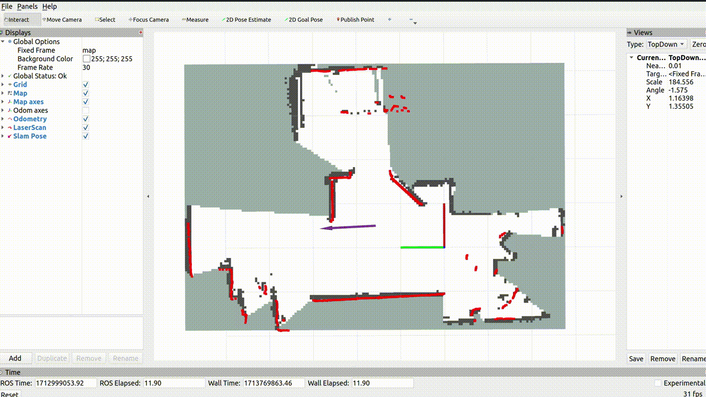
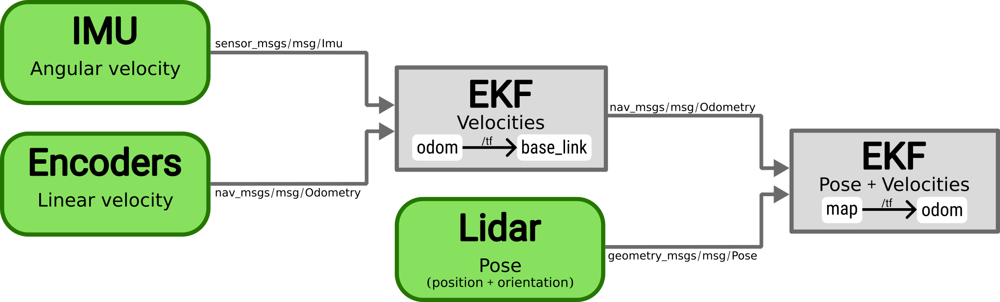

# localization-with-ROS
This repository contains tutorials on the ROS2 packages `slam_toolbox` and `robot_localization`.

`slam_toolbox` is a ROS2 packages that can perform Simultaneous Localization And Mapping (SLAM) or just Localization on an earlier created map.

`robot_localization` is a ROS2 package that implements an Extended Kalman Filter (EKF), which is basically a Kalman Filter that uses a nonlinear model. It produces a filtered odometry estimate (position, orientation, velocity) based on different sensors.

## Installation

Download the repository in a workspace and build it. Make sure to use the same workspace location and name in order to be able to directly copy the commands in the tutorials below:

    mkdir -p ~/tutorial_ws/src
    cd ~/tutorial_ws/src
    git clone git@github.com:christiaantheunisse/localization-with-ROS.git .  # to install without project folder
    cd ..
    colcon build --packages-select slam_tutorial
    source install/setup.bash

Make sure to source your workspace (run `source ~/tutorial_ws/install/setup.bash`) in every new terminal window or add it to your `~/.bashrc`. Otherwise, ROS will give an error about the package not being found.

Download `slam_toolbox` and `robot_localizatoin` by changing `<ros2-distro>` to the ROS version you are using. This tutorial was made using `iron`:

    sudo apt install ros-<ros2-distro>-slam-toolbox
    sudo apt install ros-<ros2-distro>-robot-localization

## SLAM

The [`slam_toolbox`](https://github.com/SteveMacenski/slam_toolbox) can either perform SLAM or just localization. The launch file `slam_launch.py`  launches a node that performs SLAM. To launch this file, run the following command. This will also launch RVIZ and a bag file that contains lidar scan messages and a pose estimate based on the wheel encoders:

    ros2 launch slam_tutorial slam_launch.py using_bag_data:=true

If every works correctly, you will see something like this in RViz2. The purple arrow gives the SLAM pose and the orange arrow gives the pose based on the wheel encoder values. The SLAM node corrects the error in the encoder pose by updating the transform between the `odom` and `map` frame.

The following command can be used to save the map and use it for localization later on. The relative path for the `filename` argument of the service starts in the root of the workspace, so providing only a name like `my_first_map` will store the map in `~/tutorial_ws/my_first_map`.

    ros2 service call /slam_toolbox/serialize_map slam_toolbox/srv/SerializePoseGraph "{filename: src/slam_tutorial/map/my_first_map}"

As mentioned before, it is also possible to localize within an environment with an previously created map. Rebuild the package (`colcon build --packages-select slam_tutorial` in `~/tutorial_ws`) so ROS can find the just created map file. It is also possible to use an already available map which is called `room_map`. 

    ros2 launch slam_tutorial localization_launch.py using_bag_data:=true map_file:=my_first_map

This will launch an RVIZ window with a complete map. The SLAM pose (purple arrow) is updated every second, but this setting can be changed. You might observe that the map still gets updated during localization, but this is intended behaviour as the slam_toolbox is intended to do lifelong mapping. 

### Explanation about the inner workings

The `slam_toolbox` is responsible for the global position update (no drift over time) and should therefore, according to the ROS [convention](https://www.ros.org/reps/rep-0105.html) ([simple explanation](https://robotics.stackexchange.com/questions/109759/confusion-on-tf2-frame-name-conventions-base-link-vs-odom)), publish the `map -> odom` frame transform. So another node should publish the `odom -> base_link` transform, since the `base_link` frame is the fixed frame of the robot. In this example, the bag file contains this transform under the topic `/tf`. 
<!-- The `odom -> base_link` transform can be calculated based on sensors that drift over time (wheel encoders, IMU, etc.). So the `map -> base_link` transform defines the pose correct pose with respect to the real-world, but might contain jumps / be discontinouos. The `odom -> base_link` transform is continuous, but drifts over time, which is especially relevant for velocity and accelerations. -->

As far as I understand it, the `slam_toolbox` uses a SLAM algorithm that assumes that the updated pose should be in the vicinity of the previous pose, since it searches around the previous pose to find the updated pose. So a sudden 'jump' of the robot in the `map` frame (=real world), will violate this constraint and make the algorithm lose track of the pose from which it is not able to recover. This problem can in occur in one of the following situations:

- When the computational load is too high, the calculations will not be finished in time and the difference between two consecutive poses will be big enough to violate the assumption. The Raspberry Pi 4 I use, does not have enough computational power to do the calculations and therefore, I run the SLAM node on my laptop.
- At start up, when the `map_start_pose` parameter is too far off from the actual pose. This is only relevant in the localization mode.

### For a deeper dive
A lot more information can be found on the [GitHub page](https://github.com/SteveMacenski/slam_toolbox) and in this [ROSCon Talk](https://vimeo.com/378682207). The GitHub page has a clear documentation of all the parameters and available services. Among other things, it is possible to...
- ...change the update rate and conditions.
- ...use it as a lifecycle node.
- ...set the initial pose through RVIZ's '2D Pose Estimate' or the `/initialpose` topic.
- ...use an RViz plugin which can be used if you do a lot of mapping and saving of files.

## EKF

Setting up the Extended Kalman Filter (EKF) from the `robot_localization` packages is a more complicated task, but will significantly increase the localization performance compared to using the wheel encoder odometry together with the SLAM. We define the odometry as the pose (position and orientation) and the velocity (linear and angular) of the robot. Besides we will also add an IMU.

This tutorial is not intended to be a complete guide on the [`robot_localization`](https://github.com/automaticaddison/robot_localization) packages, but the goal is to provide you with a basic understanding, some pointers and a working setup to experiment with. I hope this enables you find your way in the documentation and to setup the EKF on your own robot.

### Explanation on the sensors and structure
An EKF ([video](https://www.youtube.com/watch?v=E-6paM_Iwfc&t=3s) on the ekf) is a version of the kalman filter and can be used to improve the odometry estimate by combining multiple sensors over time. Based on the uncertainty of the sensor measurements and the uncertainty in the prediction step, it is able to assign an uncertainty to the final estimate.

In this tutorial we are going to use two EKFs to merge the data from three sensors:
- IMU (Intertial Measurement Unit): This sensor contains a accelerometer, gyroscope and magnetometer to measure the angular velocities, linear accelerations and the strength of the magnetic field in each direction. The angular velocity will be used for the odometry estimate.
- Wheel encoders: Wheel encoders measure the amount or rate of rotations of wheels which can be used to estimate the odometry of the robot. The pose estimate is guaranteed to drift over time and will become useless at some point. However, the velocities can be estimated fairly accurately by these types of sensors and will be used.
- Lidar: The earlier discussed `slam_toolbox` determines the pose of the robot compared to its surroundings (the real world).

The diagram below gives an overview of the node structure and the merged information. Two ekfs are used:
1. The first EKF merges the velocities from the IMU and wheel encoders and provides an estimate of the velocity and position. The estimated position is used to determine the `odom => base_link` transform, but will drift over time. Therefore, only the estimated velocity is used downstream.
2. A second EKF merges the velocity estimated by the other ekf and the lidar pose. This results in a final odometry estimate that does not drif over time.

To run only the first EKF that merges the velocities, launch the following launch file.

    ros2 launch ekf_tutorial velocity_ekf_launch.py  using_bag_data:=true

RVIZ shows the `odom` frame and visualizes the estimated pose. The grey cube represents the orientation estimated by the IMU. It can be seen that the estimated pose drifts over time, since the vehicle is actually driving the same box-shape path as in the SLAM example and should return in the origin everytime. The purple oval shape gives the uncertainty on the position (covariance). The uncertainty should explode over time. However, the reason that this does not happens is that the uncertainty on the odometry which is defined in the message is 0 (default value).

To run both EKFs and get a pose estimate in the map frame, launch the following launch file.  

    ros2 launch ekf_tutorial position_ekf_launch.py  using_bag_data:=true

The `odom` frame axes are also visualized and you can see how the difference between the `map` frame and the `odom` frame increases over time. When you run `ros2 topic list` you should see (among other topics):

    /odometry/position_ekf
    /odometry/velocity_ekf
    /odometry/wheel_encoders

This approach might look similar to the SLAM example above, which did not include an IMU and does not use the EKFs. However, from what I have seen on my robot, the robot can track a path much better, because the pose and velocity estimates are smoother (less noisy). 

When you want to apply the EKFs on your own robot, carefully read through their documentation. Especially the part on [how to prepare your sensor data](https://docs.ros.org/en/melodic/api/robot_localization/html/preparing_sensor_data.html). If this part is not perfectly done, the EKF will never return a proper estimate.

### For a deeper dive
For a better understanding of the package, you can have a look at the `ekf_tutorial/config/ekf.yaml` file which contains the setup for both EKFs. The matrices determine which information is used from each sensor. More information on this and on the other parameters can be found [here](https://docs.ros.org/en/melodic/api/robot_localization/html/configuring_robot_localization.html). To get a better understanding of the whole package, have a look at this [ROSCon Talk](https://vimeo.com/142624091).

In `ekf.yaml` it can be seen that I use the absolute yaw angle and set the sensor to differential mode. According to the documentation the absolute yaw angle "is converted to a velocity by calculating the change in the measurement value between two consecutive time steps". Although this is generally discouraged to use, I decided to do so in my case because the absolute angle given by the IMU is calculated by using the MadgwickAHRS algorithm, which uses the accelerometer, gyroscope and optionally magnetometer to calculate the absolute angle. By calculating the angular velocity from the absolute angle, the angular velocity will also rely on all three of these sensors as opposed to directly using the angular velocity which is taken from the gyroscope.

When you do not have a IMU, you can also use the angular velocity estimate from the wheel encoders. However, this is in general less accurate then the angular velocity from an IMU.

## Exercise

To get your hands dirty you could try to combine the functionality from both packages. You should make a launch file that uses the bag file from the `slam_tutorial` package. The `slam_toolbox` should be used in either mapping or localization mode to provide the pose in the map frame, while the IMU and encoder readings are still provided by the bag file. Subsequently, apply the two ekfs to get a filtered pose estimate. Since the EKFs provide the transforms between the different planes, the SLAM node should not publish a transform. This can be achieved by setting  `transform_publish_period: 0.`.